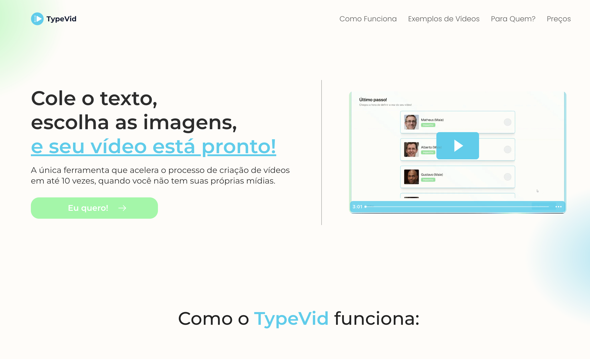
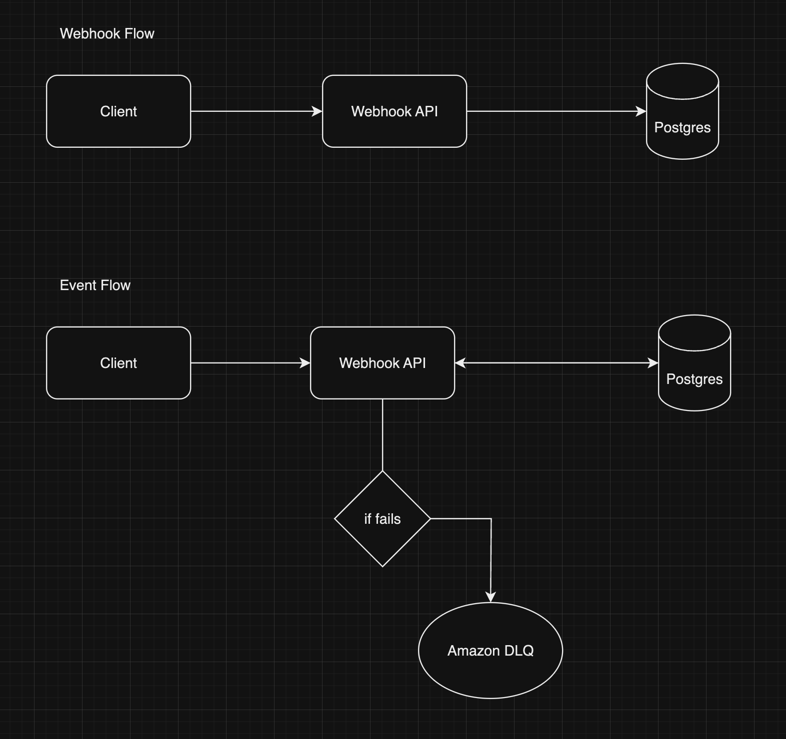

# Typevid Webhooks



Este projeto é parte do desafio técnico para a vaga de Desenvolvedor Pleno na Typevid.

O que é a TypeVid? A TypeVid é uma ferramenta que acelera o processo de criação de vídeos em até 10 vezes, quando você não tem suas próprias mídias.

[https://typevid.io/](https://typevid.io/)

## Arquitetura



## Tecnologias utilizadas

- Typescript
- AWS SQS e DLQ
- Docker
- NestJS
- ReactJS
- Zod
- React Hook Form
- Axios
- TailwindCSS
- Shadcn/ui

## Por que essas tecnologias?

- NestJS: Framework utilizado para desenvolvimento backend em NodeJS, possui arquitetura modular o que facilita a organização do código e a manutenção do projeto. Além disso, possui diversos facilitadores, como a inversão de dependencia, que nos permite separar a lógica de negócio da implementação concreta.

- ReactJS: Framework utilizado para desenvolvimento frontend, possui uma curva de aprendizado baixa e é muito utilizado no mercado. Além disso, possui uma comunidade muito ativa e diversos pacotes que facilitam o desenvolvimento.

- Zod: Biblioteca utilizada para validação de dados, possui uma sintaxe muito simples e é muito performática.

- React Hook Form: Biblioteca utilizada para gerenciamento de formulários, possui uma API muito simples e é muito performática.

- TailwindCSS: Framework moderno de CSS que nos permite criar interfaces de forma muito rápida e intuitiva.

## Como rodar o projeto

Requisitos:

- NodeJS
- Docker

Docker

```
$ docker compose up -d
```

Back End

```bash
$ cd apps/api
$ npm install
$ npm run start:dev
```

Front End

```bash
$ cd apps/web
$ npm install
$ npm run dev
```

## Propostas de Melhorias

- Adicionar lógica de autênticação

## Rotas

#### Webhook

- GET /v1/webhook

  - Descrição: Retorna todos os webhooks cadastrados
  - Exemplo de resposta:

  ```json
  [
    {
      "id": "co291jdi1jd19je",
      "name": "Example Webhook",
      "eventType": "VIEW_ITEM",
      "url": "https://example.com/webhook",
      "createdAt": "2024-05-22T10:00:00Z"
    }
  ]
  ```

- POST /v1/webhook

  - Descrição: Cadastra um novo webhook
  - Exemplo de requisição:

  ```json
  {
    "name": "Example Webhook",
    "eventType": "VIEW_ITEM",
    "url": "https://example.com/webhook"
  }
  ```

  - Exemplo de resposta:

  ```json
  {
    "id": "co291jdi1jd19je",
    "name": "Example Webhook",
    "eventType": "VIEW_ITEM",
    "url": "https://example.com/webhook",
    "createdAt": "2024-05-22T10:00:00Z"
  }
  ```

- UPDATE /v1/webhook/:id

  - Descrição: Atualiza um webhook
  - Exemplo de requisição:

  ```json
  {
    "name": "Example Webhook",
    "eventType": "VIEW_ITEM",
    "url": "https://example.com/webhook"
  }
  ```

  - Exemplo de resposta:

  ```json
  {
    "id": "co291jdi1jd19je",
    "name": "Example Webhook",
    "eventType": "VIEW_ITEM",
    "url": "https://example.com/webhook",
    "createdAt": "2024-05-22T10:00:00Z"
  }
  ```

- DELETE /v1/webhook/:id

  - Descrição: Deleta um webhook
  - Exemplo de resposta:

  ```json
  {
    "id": "co291jdi1jd19je",
    "name": "Example Webhook",
    "eventType": "VIEW_ITEM",
    "url": "https://example.com/webhook",
    "createdAt": "2024-05-22T10:00:00Z"
  }
  ```

### Event

- POST /v1/event

  - Descrição: Cadastra um novo evento
  - Exemplo de requisição:

  ```json
  {
    "message": "This is the message",
    "eventType": "VIEW_ITEM"
  }
  ```
